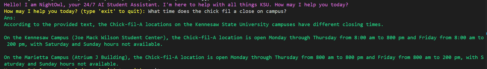

# NightOwl
24/7 AI Student Assistant for KSU. This web crawler scrapes pages on the kennesaw.edu domain to create a dataset of documents for use in developing a language model to answer questions and summarize results relevant to users of the KSU website. 



## Results:
After scraping over 10,000 web pages on the kennesaw.edu domain, we've created a dataset consisting of millions of words. The words of highest frequency are listed below. Frequencies will be updated as more documents are scraped and processed. We scraped several times to create datasets with differing page counts, with datasets consisting of 100 pages, 1000, 5000, and 10000 pages.

```bash
Total words: 6960982
Total documents: 14361
Avg words per page: 484

500 most occurring words:
 1. students                      : 87114
 2. faculty                       : 66132
 3. ksu                           : 65482
 4. kennesaw                      : 61071
 5. university                    : 54544
 6. resources                     : 49127
 7. state                         : 48883
 8. campus                        : 46638
 9. research                      : 45619
10. alumni                        : 42991
11. student                       : 42792
12. community                     : 38158
13. business                      : 37824
14. information                   : 36887
15. online                        : 36666
16. 2024                          : 35168
17. staff                         : 34406
18. education                     : 33763
19. marietta                      : 31514
20. family                        : 31230
```
## How to run:

Clone this repository. If you haven't already, it is advised you create a virtual machine, and install the requirements for this project.

Then, to run the web crawler, change to the spiders directory, and use the scrapy commands. 
```bash
$ cd ksucrawler/ksucrawler/spiders
$ scrapy crawl -O [YOUR_FILE_NAME].json:json kennesaw_spider
```

The output of the crawler will be displayed in the json file. To create a new json file, specify it on the command line.

### Creating a vocabulary

After creating the JSON file, you may create a vocabulary using the **clean.py** file in the **NightOwl** folder. Specify the desired file to clean and create a vocabulary for in the **clean.py** script, and run:

```bash
$ python clean.py
```

The script will output the vocabulary and cleaned text, which can be submitted as input to the RAG code in the RAG folder. You may edit the script to save data and use it how you like.

### Where's my data?

The results from **crawler.py** are stored in **ksucrawler/ksucrawler/spiders/ksudocs.json**, or whichever name you chose for your json file.

## How to modify:

The functionality of the crawler can be modified using the **crawler.py** script located in the **ksucrawler/ksucrawler/spiders folder**. Potential areas of modification include the following.

### Crawler settings

Potential settings to modify include how the agent identifies itself in HTTP requests, delay before downloading web pages, order of page exploration (depth first vs breadth first), number of pages crawled, etc.

```python
custom_settings = {
# Self identification
    "USER_AGENT" : "NLP @ KSU",

    # Wait before downloading consecutive pages
    "DOWNLOAD_DELAY" : 2,

    # FIFO/BFO: From https://doc.scrapy.org/en/latest/faq.html#does-scrapy-crawl-in-breadth-first-or-depth-first-order
    "DEPTH_PRIORITY" : 1,
    "SCHEDULER_DISK_QUEUE" : "scrapy.squeues.PickleFifoDiskQueue",
    "SCHEDULER_MEMORY_QUEUE" : "scrapy.squeues.FifoMemoryQueue",

    # Number of pages to fetch before terminating crawler (should be increased after testing is done)
    # "CLOSESPIDER_PAGECOUNT" : 10,
}
```

### Data extraction and storage

Currently HTML tags are removed, but there is still room for data processing. If we want to extract additional features like emails and phone numbers, we could add regular expressions after HTML tag removal.

```python
# Remove HTML tags from each document
html = BeautifulSoup(response.body, "html.parser")
for tag in html.find_all(True):
    tag.attrs = {}
body = html.get_text()

'''
TODO: 
if there is anything else we want to store, 
create a rule and structure for that here. 
For example, utilize regex to extract 
emails and phone numbers.
'''
```

Then add the additional data to be stored in the yield statement, which includes the data saved after crawling is complete.

```python
yield { 
    "pageid" : hashlib.md5(response.url.encode()).hexdigest(),
    "url" : response.url,
    "title" : response.css("title::text").get(),
    "body" : body,
    # TODO: additional document contents to extract, if wanted
}
```

## RAG
To run RAG, simply execute the command
```bash
python rag/rag2.py
```

This will load existing embeddings, or create new ones if you scraped a new dataset. Then you may query the Llama model for information that can be retrieved from the dataset. For example:

```text
Hello! I am NightOwl, your 24/7 AI Student Assistant. I'm here to help with all things KSU. How may I help you today?
How may I help you today? (type 'exit' to quit): when are the 2024 commencement ceremonies?
Ans: 
According to the provided text, the 2024 Commencement Ceremony is scheduled for:

* December 10th (Tuesday) - morning ceremony
* December 11th (Wednesday) - afternoon/evening ceremony
* December 12th-13th (Thursday-Friday) - additional ceremonies may be held

Please note that these dates are subject to change, and it's always best to check with Kennesaw State University's official website or contact their administration office for the most up-to-date information.
```

```text
How may I help you today? (type 'exit' to quit): What time does the chick fil a close on campus?
Ans: 
According to the provided text, the Chick-fil-A locations on the Kennesaw State University campuses have different closing times.

On the Kennesaw Campus (Joe Mack Wilson Student Center), the Chick-fil-A location is open Monday through Thursday from 8:00 am 
to 800 pm and Friday from 8:00 am to 200 pm, with Saturday and Sunday hours not available.

On the Marietta Campus (Atrium J Building), the Chick-fil-A location is open Monday through Thursday from 800 am to 800 pm and 
Friday from 800 am to 200 pm, with Saturday and Sunday hours not available.
```

## Important resources
* [Scrapy]("https://docs.scrapy.org/en/latest/intro/overview.html") for crawling KSU web pages and creating the dataset
* [Llama3]("https://ollama.com/library/llama3") for creating the base LLM for RAG

## Contributors
* Nicholas Wile
* Aidan Mitchell
* Afifa Jinan